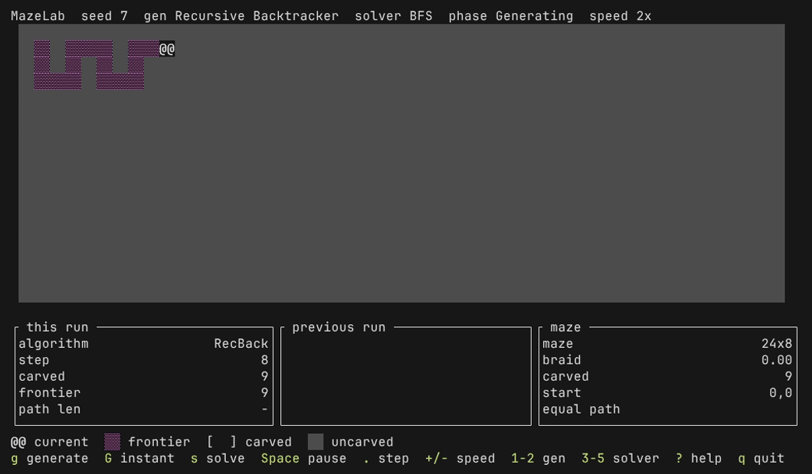

# MazeLab

MazeLab is a terminal application that animates maze generation and
pathfinding. It shows an algorithm one step at a time. You see the cell it acts
on, its **frontier**, and the cells that a solver **expanded**.



The demo is four beats on seed 7: generate, solve with BFS, swap to A\*, and
solve again. [`docs/media/demo.tape`](docs/media/demo.tape) records it with
[`vhs`](https://github.com/charmbracelet/vhs).

## Run it

MazeLab needs Rust 1.88.0 or later.

```sh
cargo run --release --locked
```

The demo maze, with BFS selected:

```sh
cargo run --release --locked -- --seed 7 --width 24 --height 8 --solver bfs
```

`cargo run --release -- --help` lists the flags. Without `--seed`, MazeLab
draws a fresh seed. Without `--width` or `--height`, MazeLab uses the largest
size that the terminal can show on that axis. Below 79 x 19 it uses 4.

MazeLab has two generators, Recursive Backtracker and Randomized Prim, and three
solvers, DFS, BFS and A\*.

## Keys

The help row at the bottom of the screen names the main keys:

```text
g generate  G instant  s solve  Space pause  . step  +/- speed  1-2 gen  3-5 solver  ? help  q quit
```

Press `?` for the full keymap. It also holds `Tab`, the arrow keys, `f`, `n`
and `b`.

## Why the solvers in the demo find paths of the same length

At braid factor 0 the maze is **perfect**, so one path joins start and goal,
and every solver returns it: equal lengths are expected, not a broken
comparison. Watch **expanded** instead, the cells a solver searched: in the
demo, BFS expands 176 and A\* 122.

## Promises

MazeLab makes two promises, and no others:

- **Determinism.** The same seed, the same size and the same version of MazeLab
  give the same maze on Linux, Windows and macOS. This is not a promise across
  versions ([ADR 0005](docs/adr/0005-determinism-is-scoped-to-one-version.md)).
  The braid factor has no flag, so the command line reproduces a maze only at
  braid factor 0.
- **The MSRV.** MazeLab builds with Rust 1.88.0. A CI job builds it with that
  toolchain on every push to `main` and on every pull request into `main`.

## Cross-platform is a report, not a promise

The CI matrix proves that MazeLab compiles, tests and lints clean on Linux,
Windows and macOS. For macOS, the matrix is the only evidence.

The tests render into memory, not on a real terminal, so they prove nothing
about fonts or colour tables. What they do prove is that MazeLab stays legible
when colour is absent: the glyph alone identifies each cell state.

If block glyphs do not draw correctly in your terminal, run MazeLab with
`--ascii`. The legend row shows every glyph and colour of the current phase, so
you can check on screen.

## Add an algorithm

[`docs/extending.md`](docs/extending.md) adds a generator by a tour of
`src/generator/prim.rs`. The contract that a generator or a solver must keep is
in the rustdoc of `src/generator/mod.rs` and `src/solver/mod.rs`. MazeLab does
not publish its rustdoc. Build it locally:

```sh
cargo doc --no-deps --open
```

## Design

- [`CONTEXT.md`](CONTEXT.md) is the glossary. The code, the screen and these
  documents use its terms.
- [`docs/adr/`](docs/adr/) holds the decisions that are hard to reverse, each
  with its reason.

## Develop

```sh
cargo test --locked
cargo clippy --locked --all-targets -- -D warnings
cargo fmt --all --check
```

To record the demo again, install `vhs` and run `vhs docs/media/demo.tape` from
the repository root.
